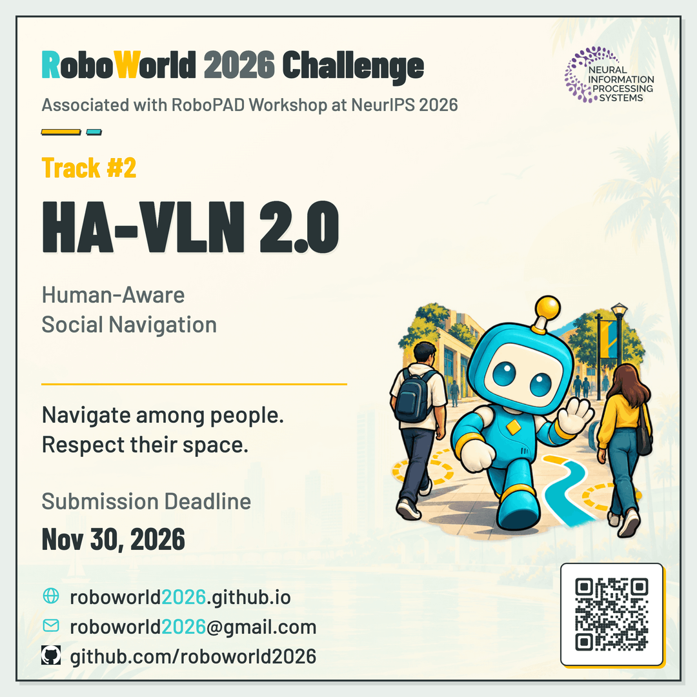
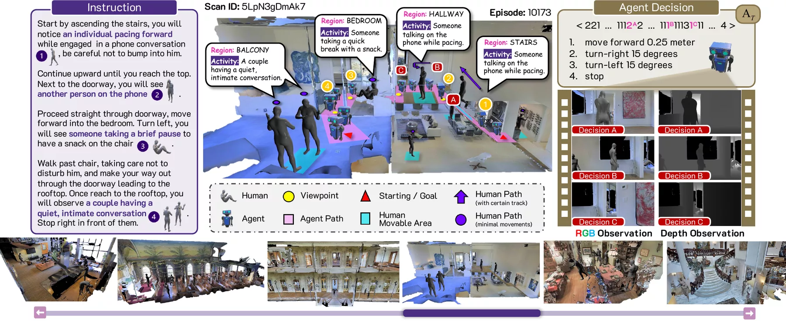

<h1 align="center">🤖 RoboWorld 2026 Track 2: HA-VLN<br>Human-Aware Vision-and-Language Navigation</h1>

<div align="center" markdown="1">

**Official participant toolkit for [RoboWorld 2026](https://roboworld2026.github.io/) Track 2**

*Built on [HA-VLN 2.0](https://uwmilab.github.io/HA-VLN-webpage/) and affiliated with the [RoboPAD Workshop at NeurIPS 2026](https://robotpad2026.github.io/)*

[](https://roboworld2026.github.io/)
[](https://roboworld2026.github.io/track2)
[](https://www.codabench.org/competitions/18135/)
[](https://robotpad2026.github.io/)
[](https://arxiv.org/abs/2503.14229)

<p align="center">
  
</p>

**🏆 Awards: Official Certificates for Top 5 Teams & NeurIPS 2026 RoboPAD Workshop Oral Presentations**

</div>

## 🌍 Challenge Overview

HA-VLN evaluates embodied agents on **human-aware vision-and-language navigation**
in continuous 3D environments populated by dynamic people. Unlike static VLN
benchmarks, [HA-VLN 2.0](https://arxiv.org/abs/2503.14229) requires agents to
ground human-referenced route instructions, adapt to moving bystanders, and
reach the goal without human collisions. Official scoring replays submitted
action sequences in the released HA-VLN 2.0 Habitat 0.1.7 runtime, and any
policy, planner, world model, or VLA method that outputs valid actions is welcome.

<p align="center">
  
</p>

### 🎯 Task Definition

| Component | Description |
|:--|:--|
| Input | Episode ID, initial position and yaw, navigation instruction, and released human-aware episode inputs. |
| Output | One sequence made from six discrete VLN-CE actions. |
| Actions | `STOP`, `MOVE_FORWARD`, `TURN_LEFT`, `TURN_RIGHT`, `LOOK_UP`, `LOOK_DOWN`. |
| Budget | 1–500 actions; all six actions count toward the limit. |
| Evaluation | Trusted simulator replay measuring navigation and human-aware safety. |

## 📅 Competition Details

- **Event:** [RoboWorld Challenge 2026, Track 2](https://roboworld2026.github.io/track2).
- **Affiliated workshop:** [RoboPAD Workshop at NeurIPS 2026](https://robotpad2026.github.io/).
- **Registration:** register through the [Google Form](https://roboworld2026.github.io/#registration) (registration opens Oct 08, 2026) to be eligible for the leaderboard, certificates, and awards.
- **Submission platform:** [CodaBench — HA-VLN](https://www.codabench.org/competitions/18135/).
- **Submission limits:** five per day and 100 per phase; the best score is retained.

### 🗓️ Timeline

| Event | Date |
|:--|:--|
| Registration opens | October 08, 2026 (via [Google Form](https://roboworld2026.github.io/#registration)) |
| Data, baselines & servers online (Phase 1 opens) | October 15, 2026 |
| Phase 1 deadline / Phase 2 opens | October 30, 2026 |
| Final submission deadline (Phase 2 closes) | November 30, 2026 |
| Award decision announcement | December 12, 2026 |

*Follow the [competition page](https://www.codabench.org/competitions/18135/) and [track website](https://roboworld2026.github.io/track2) for any updates.*

### 🗂️ Phases

| Phase | Duration | Submission | Leaderboard role |
|:--|:--|:--|:--|
| Phase 1: Validation | Oct 15 – Oct 30, 2026 | Released `val_seen` and `val_unseen` action sequences | Reports both splits; ranks by full-precision `val_unseen` Score. |
| Phase 2: Final Test | Oct 30 – Nov 30, 2026 | Action sequences for the held-out phase bundle | Determines final ranking and awards. |

Both phases use the same six-action JSON contract and Score. Phase 1 and Phase
2 results are not combined.

### 🏆 Awards & Recognition

| Recognition | Description |
|:--|:--|
| 📜 **Certificates of Recognition** | Official certificates awarded to the **Top 5 teams** in Track 2 |
| 💡 **Best Innovative Solution** | Certificate recognizing outstanding creativity and technical innovation |
| 🎤 **Oral Presentations** | Selected top-performing teams will be invited to give oral presentations at the **RoboPAD Workshop @ NeurIPS 2026** |

## 🚀 Getting Started

This walkthrough runs the released CMA checkpoint, records the actions actually
executed, and produces a validated submission ZIP. You may instead use any agent
that follows the [submission contract](#-submission-format).

### 1. Download data and the CMA checkpoint

Use Python 3 and `curl` on a Linux/WSL filesystem to download from
[Hugging Face](https://huggingface.co/datasets/fly1113/HA-VLN).
The helper pins resource revisions, verifies SHA-256 checksums, resumes interrupted
downloads, and extracts HAPS 2.0 into the required layout:

```bash
DATA_ROOT=/absolute/path/to/havln2-data
bash scripts/download_data.sh --destination "$DATA_ROOT" --target all
```

Use a Linux/WSL filesystem for HAPS 2.0 asset extraction. Place your licensed
Matterport3D scenes under `$DATA_ROOT/scene_datasets/mp3d/<scan>/<scan>.glb`.

### 2. Start a development container and install CMA dependencies

From this toolkit's root directory, create a named container with persistent
data and output mounts:

```bash
IMAGE=ghcr.io/jostarxiong/havln-challenge-2026@sha256:e1a0544f66beaf5218cc9df63da51b4a1a22a6bf0471ca0c2f75e81ee02a6556
WORK_ROOT=/absolute/path/to/havln-workspace
mkdir -p "$DATA_ROOT" "$WORK_ROOT"
docker pull "$IMAGE"
docker run --name havln-cma --gpus all -it --shm-size 16g \
  --mount type=bind,source="$DATA_ROOT",target=/data/havln2 \
  --mount type=bind,source="$WORK_ROOT",target=/workspace \
  --mount type=bind,source="$(pwd)",target=/toolkit,readonly \
  "$IMAGE" bash
```

Inside the container:

```bash
bash /toolkit/scripts/setup_cma.sh
havln-check-data
```

The setup script retrieves pinned public policy sources and installs the inference
dependencies while retaining the image's Habitat core. Re-enter with
`docker start -ai havln-cma` after exiting.

### 3. Run CMA and export the executed actions (Optional)

You do not need to use the CMA baseline for your competition submission; any model or planning approach that outputs valid action sequences is welcome. We provide this reference baseline walkthrough to illustrate how to export and verify a valid submission archive.

To run CMA inference and export action predictions for the validation splits:

```bash
python /toolkit/scripts/export_cma_submission.py \
  --output-dir /workspace/cma-submission
```

For multiple GPUs, append `--gpu-ids 0 1` (container-visible GPU indices). The exporter retains completed scan shards, so the same command can resume an interrupted run. Local multi-GPU subprocess logs and export metadata are saved alongside the results.

Completing all **778 `val_seen` and 1,839 `val_unseen` episodes** automatically packages `val_seen.json`, `val_unseen.json`, and `submission.zip`.

### 4. Validate and submit

Inside the container, verify your submission package:

```bash
havln-validate /workspace/cma-submission/submission.zip
```

Once validated, upload `$WORK_ROOT/cma-submission/submission.zip` on your host to [CodaBench](https://www.codabench.org/competitions/18135/).

## 📊 Dataset

The challenge is built on released HA-VLN 2.0 resources: HA-R2R navigation episodes,
HAPS 2.0 dynamic human assets, and licensed Matterport3D scenes. Challenge datasets
are mounted externally into the container.

| HA-R2R split | Episodes |
|:--|--:|
| Train | 10,819 |
| Validation Seen (`val_seen`) | 778 |
| Validation Unseen (`val_unseen`) | 1,839 |
| Test | 3,408 |
| **Total** | **16,844** |

- **HA-R2R**: 16,844 instructions across 90 scenes with multi-human interaction annotations.
- **HAPS 2.0**: 486 dynamic 3D human motion sequences across 172 activities.
- **Matterport3D**: Licensed indoor scene assets. Obtain access via the [Matterport3D project](https://niessner.github.io/Matterport/): place extracted meshes under `$DATA_ROOT/scene_datasets/mp3d/<scan>/<scan>.glb` (see [FAQ Q7](#-frequently-asked-questions)).

## 🧠 Baseline Model

We provide **HA-VLN-CMA** as the reference baseline for Track 2. For model architecture and training details, refer to the official [HA-VLN repository](https://github.com/UWMILab/HA-VLN). Participants are free to use any model, planner, or VLA approach that outputs valid discrete action sequences.

Evaluating the released CMA validation checkpoint produces reference results:

| Split | SR ↑ | NE ↓ | CR ↓ | TCR ↓ | Score ↑ |
|:--|--:|--:|--:|--:|--:|
| `val_seen` | 0.180 | 6.223 | 0.623 | 13.726 | 16.509450 |
| `val_unseen` | 0.129 | 6.387 | 0.684 | 17.536 | 12.945387 |

*Note: Component metrics are rounded for display. All official rankings and leaderboard scores are determined by CodaBench replay evaluation.*

## 📏 Evaluation

| Metric | Direction | Meaning |
|:--|:--|:--|
| SR (Success Rate) | Higher | Collision-free success rate over all episodes. |
| NE (Navigation Error) | Lower | Mean final navigation error in metres. |
| CR (Collision Rate) | Lower | Collision-episode rate over human-influenced episodes. |
| TCR (Total Collision Rate) | Lower | Mean adjusted human-collision count over all episodes. |

### 🏁 Composite Score

The composite Score combines navigation and social compliance metrics (higher is better):

$$
\begin{aligned}
\mathrm{Navigation} &= 0.80 \times \mathrm{SR} + 0.20 \times \frac{3}{3 + \mathrm{NE}}, \\
\mathrm{Social} &= 0.75 \times (1 - \mathrm{CR}) + 0.25 \times \frac{1}{1 + \mathrm{TCR}}, \\
\mathrm{Score} &= 100 \times \mathrm{Navigation} \times (0.70 + 0.30 \times \mathrm{Social}).
\end{aligned}
$$

Higher Score ranks first. Exact ties use higher SR, lower NE, lower CR, lower
TCR, then earlier submission time. Calculation and comparison retain full
precision.

## 📥 Submission Format

Phase 1 requires one valid prediction JSON for each validation split. The
following ZIP is the recommended layout, not a filename restriction:

```text
submission.zip
├── val_seen.json
└── val_unseen.json
```

Each file follows this schema (the invented ID is only an illustration):

```json
{
  "format_version": 1,
  "split": "val_unseen",
  "episodes": [
    {
      "episode_id": "synthetic-example-001",
      "actions": ["MOVE_FORWARD", "TURN_LEFT", "LOOK_UP", "LOOK_DOWN", "STOP"]
    }
  ]
}
```

Include every official episode ID exactly once. `STOP`, if present, occurs once
at the end; sequences shorter than 500 actions require it. The examples in
[`examples/submission`](examples/submission) demonstrate schema only and do not
have complete manifest coverage.

The validator identifies predictions by each JSON object's `split` value, so
you may rename the files and include harmless extra root files. It rejects
missing or duplicate required splits, invalid prediction content, unsafe ZIP
members, and nested paths. Phase 2 follows the same rule with its single
required `test` split when that phase opens.

## ❓ Frequently Asked Questions

**Q1. Must I use CMA or a particular architecture?**

No. Any method is eligible if it exports legal official action sequences.

**Q2. Do I submit code, weights, or a container?**

No code, weights, or containers:
- **Standard Submission:** Upload only the required JSON action-sequence files in a single ZIP.
- **Award Winners:** Teams qualifying for awards (Top 5, Best Innovative Solution, or RoboPAD presentation) will be expected to contribute to a technical report and may be asked to provide code or models for verification.

**Q3. Are `LOOK_UP` and `LOOK_DOWN` valid?**

Yes. Both actions are valid and count toward the 500 task steps.

**Q4. Does an action advance a human animation frame?**

No. Human animation follows released wall-clock behavior independently.

**Q5. Does local validation compute a Score?**

`havln-validate` checks structure and coverage only. Local replay can compute
metrics for development, but only the official replay result published on
CodaBench for the submitted archive determines leaderboard scores and awards.
Results from another machine are not accepted as official scores.

**Q6. Why did my ZIP fail validation?**

`SUBMISSION REJECTED:` means the ZIP needs correction: check for a parent
folder, missing or duplicate split, duplicate/missing episode IDs (778
`val_seen` and 1,839 `val_unseen` are required), invalid action names, or
incorrect `STOP` placement. `PASS:` means validation or replay succeeded.
`SCORING DATA ERROR (organizer):` indicates a scoring-side problem; report
the submission identifier rather than changing valid predictions.

**Q7. Can the image download Matterport3D for me?**

No. Request access through the [Matterport3D dataset page](https://niessner.github.io/Matterport/):
sign its Terms of Use and email the form to `matterport3d@googlegroups.com`.
After approval, use the [HA-VLN 2.0 VLN-CE scene guide](https://github.com/UWMILab/HA-VLN/blob/main/agent/VLN-CE/README.md#scenes-matterport3d),
and place the licensed scenes under your host data root's
`scene_datasets/mp3d/`. That root can be anywhere on your machine. When using
the challenge Docker image, mount it at `/data/havln2` inside the container.

## 🔗 Resources and Contact

| Resource | Link |
|:--|:--|
| HA-VLN 2.0 | [Project page](https://uwmilab.github.io/HA-VLN-webpage/) & [GitHub](https://github.com/UWMILab/HA-VLN) |
| RoboWorld 2026 | [Challenge website](https://roboworld2026.github.io/) |
| Track 2 HA-VLN | [Track website](https://roboworld2026.github.io/track2) |
| CodaBench Platform | [Submissions and leaderboard](https://www.codabench.org/competitions/18135/) |
| RoboPAD Workshop | [RoboPAD @ NeurIPS 2026](https://robotpad2026.github.io/) |

For technical support, use [GitHub Issues](https://github.com/roboworld2026/track2/issues).
For event and registration questions, email [roboworld2026@gmail.com](mailto:roboworld2026@gmail.com).

### 💬 Community & Discussion

- **Discord:** [Join the RoboWorld Track 2 Discord](https://discord.gg/S8s8JcxtT)
- **WeChat Group:** [Join the RoboWorld Track 2 WeChat Group](https://github.com/roboworld2026/roboworld2026.github.io/blob/main/wechat_track2.JPG)

<a href="https://github.com/roboworld2026/roboworld2026.github.io/blob/main/wechat_track2.JPG" target="_blank"></a>

## 📄 License and Terms

HA-VLN 2.0, HA-R2R, HAPS2.0, pretrained weights, and source assets retain their upstream
licenses. Matterport3D requires separate authorized access. Participation is
governed by the Terms displayed on the official CodaBench competition.

## 📚 Citation

If you use HA-VLN 2.0 or this challenge toolkit, cite the benchmark paper:

```bibtex
@inproceedings{dong2026havln,
  author    = {Dong, Yifei and Wu, Fengyi and He, Qi and Kong, Lingdong and Li, Heng and Li, Minghan and Cheng, Zebang and Zhou, Yuxuan and Sun, Jingdong and Dai, Qi and Hauptmann, Alexander G. and Cheng, Zhi-Qi},
  title     = {{HA-VLN 2.0: An Open Benchmark and Leaderboard for Human-Aware Navigation in Discrete and Continuous Environments with Dynamic Multi-Human Interactions}},
  booktitle = {2026 IEEE/RSJ International Conference on Intelligent Robots and Systems (IROS)},
  year      = {2026},
}

@misc{roboworld2026track2,
  title={Track 2 | HA-VLN: Human-Aware Vision-and-Language Navigation},
  author={RoboWorld Challenge 2026 Organizers},
  year={2026},
  howpublished={https://roboworld2026.github.io/track2}
}
```

## 🤝 Acknowledgements

The track is organized by the RoboWorld Challenge 2026 team and affiliated with
the RoboPAD Workshop at NeurIPS 2026. We thank the HA-VLN 2.0 and VLN-CE authors,
dataset and simulator contributors, Matterport3D, and CodaBench.
